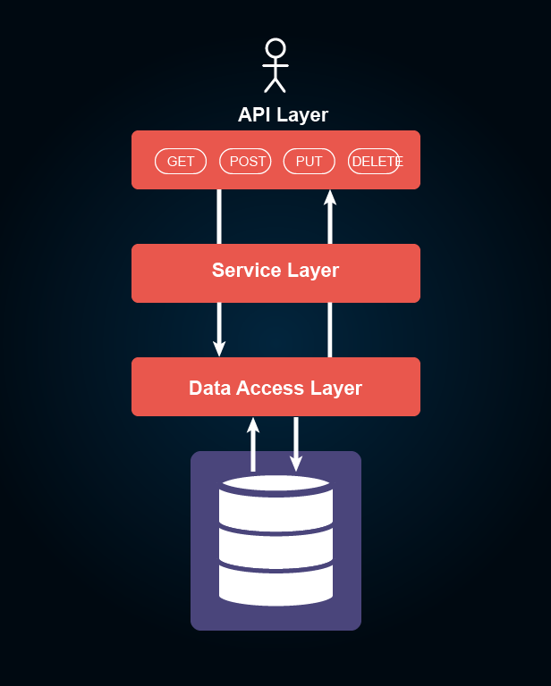

# Simple-API-with-Spring-Boot
Building a simple API using Spring Boot.
Spring Boot simplifies the development of Java-based applications by providing a convention-over-configuration approach and pre-built templates.

### Technologies:
- Spring Boot: The core framework that simplifies the development of Java applications, offering features like auto-configuration and a wide range of built-in modules.
- Maven: Build automation tools used to manage dependencies and build the project.
- Java: The primary programming language for building the application.

### Outcomes:
- The project results in a simple, yet functional API that can handle basic HTTP requests and responses.
- Easy Integration: Thanks to the simplicity of Spring Boot, the API can be easily integrated into existing projects or serve as a starting point for more complex applications.
- Scalability: The modular nature of Spring Boot allows for easy scalability as the project requirements evolve. New features and endpoints can be added without significant modifications to the existing codebase.
- Rapid Development: Leveraging Spring Boot's convention-over-configuration approach, developers can focus on business logic rather than boilerplate code, accelerating the development process.
- Documentation: As good practices, the project can include API documentation, making it easier for other developers to understand and utilize the endpoints provided by the API.
- Testing: Incorporating unit tests and possibly integration tests ensures the reliability and stability of the API.
- Deployment: The API can be deployed on various platforms, such as cloud services or on-premises servers, depending on the project requirements.

Overall, this Simple API project aims to showcase the efficiency and ease of development offered by the Spring Boot framework in creating robust and scalable web APIs.
